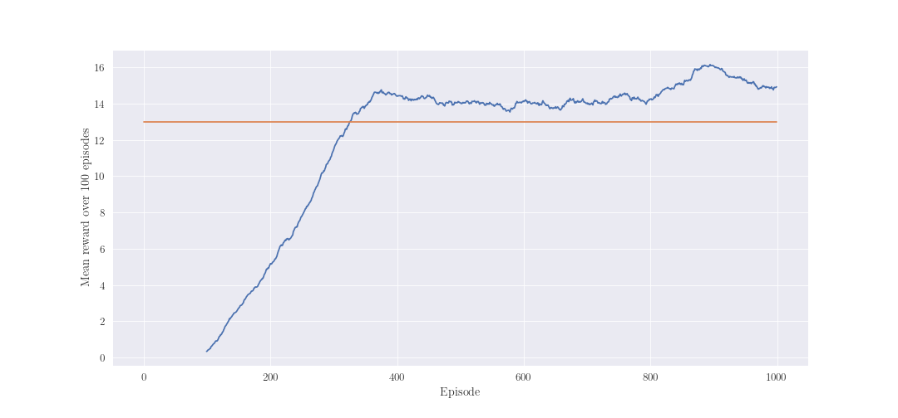

# Report

### Learning algorithm

DQN algorithm was chosen to solve Banana environment. Proposed implementation is using techniques:
1. Simple replay memory (non-prioritized)
2. Target soft update method
3. Double DQN [1]
4. Dueling DQN architecture [2]
5. NoisyNet architecture with factorized Gaussian noise [3]

#### Model
Following structure was used for agent:
* Feature layer: Linear ReLu (37, 128) 
* Advantage layer 1: NoisyNet ReLu (128, 128)
* Advantage layer 2: NoisyNet Relu (128, 4)
* Value layer 1: NoisyNet ReLu (128, 128)
* Value layer 2: NoisyNet Relu (128, 1)

Feature layer is mutual for both model's heads (advantage and value one).

#### Hyperparameters

* Learning rate (lrate): 0.0001
* Discount factor (gamma): 0.99
* Target network update frequency (target_update_frequency): 1000
* Policy network update frequency (update_frequency): 4
* Replay memory capacity (buffer_size): 100000
* Steps before learning starts (warm_up_steps): 10000
* Batch size (batch_size): 64

### Performance

Agent achieves average score 13.0 over 100 episodes at 326 episode. At this moment, training could 
be stopped, task finished. However, the learning continued and "stable point" was achieved at 375
 episode. The mean score from that moment to end is 14.45. 

### Comments

During solving this problem, the biggest challenge was to properly implement NoisyNet. In the 
paper it is said to use noisy layer at the head of model. However, first trials wasn't satisfying
. Greater improvements was observed, when noisy layer was used for whole advantage and value part
 of model (feature layer was standard linear layer). Also, setting small learning rate 
 bringed more stable training process. Same situation was with update frequency od models. Too 
 small was destabilizing training. After all, the environment could be solved with 
 standard algorithms like DQN or Double DQN without Dueling and NoisyNet. However, better result 
 was achieved after implementing those tweaks. Agent learns faster and explore more states. 

### Future ideas

For better results, following improvements could be implemented:
* Prioritized Replay Memory [4]
* Distributed Prioritized Experience Replay [5]
* n-step DQN [6]

### Bibliography

1. [van Hasselt, Hado; Guez, Arthur; Silver, David "Deep Reinforcement Learning with Double Q-learning"](https://arxiv.org/pdf/1509.06461.pdf)
2. [Wang, Ziyu; Schaul, Tom; Hessel, Matteo; et. al "Dueling Network Architectures for Deep Reinforcement Learning"](https://arxiv.org/pdf/1511.06581.pdf)
3. [Fortunato, Meire; Gheshlaghi Azar, Mohammad; et. al "Noisy Networks for Exploration"](https://arxiv.org/pdf/1706.10295.pdf)
4. [Schaul, Tom; Quan, John; Antonoglou, Ioannis; Silver, David "Prioritized Experience Replay"](https://arxiv.org/pdf/1511.05952.pdf)
5. [Horgan, Dan; Quan, John; Budden, David; et. al "Distributed Prioritized Experience Replay"](https://arxiv.org/pdf/1803.00933.pdf)
6. [Mnih, Volodymyr; Puigdomènech Badia, Adrià; et. al "Asynchronous Methods for Deep Reinforcement Learning"](https://arxiv.org/pdf/1602.01783.pdf)
