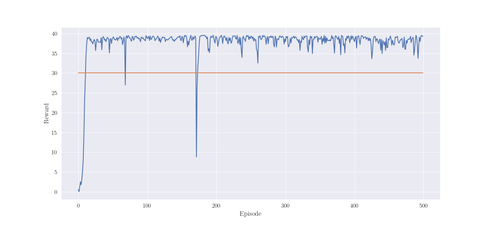
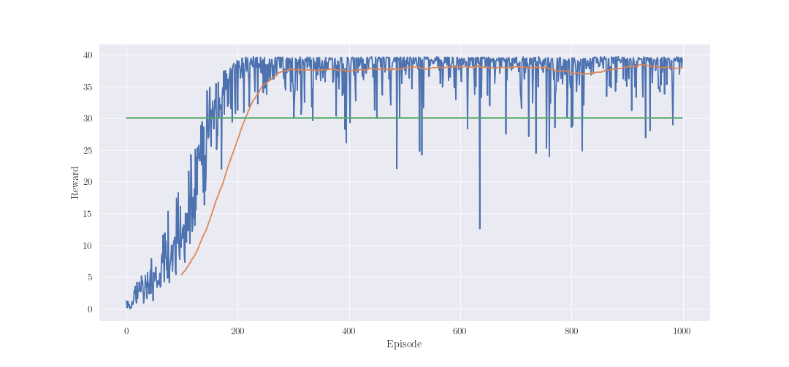

# Report

### Learning algorithm

TD3 was chosen to solve Reacher environment. The algorithm is a modification of DDPG. More 
information could be found in paper [1].Proposed implementation is using techniques:
1. Simple replay memory (non-prioritized)
2. Distributed learning
3. N-step learning
4. Delayed learning (warm up steps to fill replay memory)

### Model

Following structure was used for agent:
* Actor:
  * Layer 1: Linear ReLu (33, 512)
  * Layer 2: Linear ReLu (512, 512)
  * Policy layer: Linear Tanh (512, 4)
* Critic:
  * Layer 1: Linear ReLu (33 + 4, 512)
  * Layer 2: Linear Relu (512, 512)
  * Value layer: Linear (512, 1)
  
Critic contains two identical networks which are not mutual. It's a form of double Q-learning.

### Hyperparameters

* Critic learning rate (critic_lr): 0.001
* Actor learning rate (actor_lr): 0.001
* Target and actor networks update frequency (update_frequency): 2 
* Target and actor networks soft update factor (tau): 0.005
* Worker update frequency (worker_update_frequency): 100
* Replay memory capacity (buffer_size): 1000000
* Batch size (batch_size): 256
* N-step return (n_step): 5

### Performance

Agents was learning for 500 episodes and achieved average score 30.0 over 100 episodes after 
first 100 episodes. Stable point of the training was reached at episode number 13. The mean score
 from that moment to the end is 38.26. 

Agent was learning for 1000 episodes and achieved average score over 30.0 over 100 episodes after
 244 episodes. Stable point of training was reached at around episode number 330. The mean score 
 from that moment to end is 36.62.
 

### Comments

Simple implementation of DDPG could be used to solve this task. However, achieving convergence 
with this algorithm is difficult because DDPG is sensitive to parameters changing. Also it was 
shown in [2] that single Q network is overestimating Q-value. To reduce this problem,
double Q network was proposed [2]. State-of-art implementation of DDPG uses only one Q network. 
The combination of both models was proposed in TD3 algorithm. In the paper [1] it was shown that 
this solution achieves better results then simple DDPG.

Architecture and hiperparameters of the model was described above. Structure of actor and critic 
is the same, a simple multilayer perceptron with two hidden layers of size (512, 512). The size 
was chosen after many training attempts. However, the worst results was observed with small 
networks (i.e. (128, 128)). Hiperparameters have not been changed in relation to those 
from the article. However, in proposed algorithm small modification was implemented compared to 
original one. The n-step return was used. It gave significant speed up in training process and 
improved stability.

Before solving environment with 20 agents, the variant with one was solved. Agent was trained 
for 1000 episodes and the batch size was 100. This was the only difference between solution for 
20 agents. In this case, convergence was achieved after 330 episodes. Converting algorithm for 
single agent algorithm to multiagent was not difficult. In fact, proposed implementation is a mix
of TD3 and D4PG [3]. Core of the algorithm is taken from TD3, implementation of distributed 
training was taken from D4PG. This combination gave significant speed up in learning process and 
reached better score compared to single agent solution. 
 
Proposed algorithm is build with one master agent and n workers. Workers task is collecting 
trajectories (S, A, R, S') into shared replay memory. Master task task is to sample batch of 
trajectories from shared replay memory and update network parameters. After 100 steps masters' 
parameters are copied to workers. Workers update frequency was chosen empirically.

### Future ideas

Current solution was solved environment after 113 episodes. Probably it could be improved after
implementing following methods:
* Prioritized Replay Memory [4]
* Distributed Prioritized Experience Replay [5]

### Bibliography

1. [Fujimoto, Scott; van Hoof, Herke; Meger, David "Addressing Function Approximation Error in Actor-Critic Methods"](https://arxiv.org/pdf/1802.09477.pdf)
2. [van Hasselt, Hado; Guez, Arthur; Silver, David "Deep Reinforcement Learning with Double Q-learning"](https://arxiv.org/pdf/1509.06461.pdf)
3. [Barth-Maron, Gabriel; Hoffman, Matthew W. et. al "Distributed Distributional Deterministic Policy Gradients"](https://arxiv.org/pdf/1804.08617.pdf)
3. [Schaul, Tom; Quan, John; Antonoglou, Ioannis; Silver, David "Prioritized Experience Replay"](https://arxiv.org/pdf/1511.05952.pdf)
4. [Horgan, Dan; Quan, John; Budden, David; et. al "Distributed Prioritized Experience Replay"](https://arxiv.org/pdf/1803.00933.pdf)
