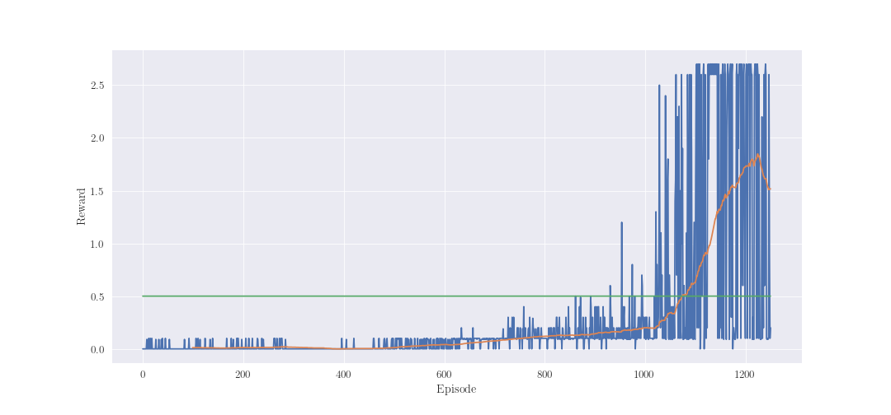

# Report

### Learning algorithm

To solve Tennis environment, the MADDPG algorithm was chosen [1]. Like in the publication, 
separated agents with own actor and critic was implemented. Proposed implementation is using 
following techinques:
1. Separated agents with own actor and critic network (as was mentioned before),
2. Simple share replay buffer (non-prioritized),
3. Delayed learning (warm up steps to fill replay memory),
4. Soft update for target networks,
5. Adaptive Gaussian noise for exploration (decaying sigma value over time).

### Model

Following structure was use for each agent:
* Actor:
  * Layer 1: Linear ReLu (24, 128)
  * Policy layer: Linear TanH (128, 2)
* Critic:
  * Layer 1: Linear ReLu (48, 128)
  * Layer 2: Linear ReLU (128 + 4 , 128)
  * Value layer: Linear (128, 1)

Input for actor network is a single agent observation. Input for critic network is full 
observation of environment (merged observations of every agents) and actions from every agents. 
However, actions are introduced to critic on layer 2.

### Hyperparameters

* Critic learning rate (critic_lr): 0.001
* Actor learning rate (actor_lr): 0.0001
* Target and actor networks soft update factor (tau): 0.005
* Replay memory capacity (buffer_size): 1000000
* Batch size (batch_size): 256
* Warm up steps (warm_up_steps): 100000
* N-step return (n_step): 1
* Exploration noise sigma decay (exploration_decay): 100000
* Exploration noise scaling factor (exploration_factor): 0.5

### Performance

Agents were learning for 1250 episodes and achieved averaged score 0.5 over 100 after 1074 
episodes. However, for around 300 episodes agents were performing pure exploration without 
learning. Taking this in concern, it could be said, that agents solved environment after 774. 
Maximum mean score achieved by agents was 1.85. 

### Comments

MADDPG algorithm is very sensitive for hyperparameters change. During solving Tennis environment 
a lot of hyperparameters configuration was tested. Some of them was giving good results some 
of them bad results. For clarification, good results was when agents solved environment in given 
episode numbers. Whereas, bad results are those where agents could not achieved averaged score of
 0.5 over 100 consecutive episodes. During implementation even changing base agent (DDPG) for 
 considered. There was feq attempts to implement TD3 algorithm for multi-agents environment. 
 However, performance of this solution was around -0.01 averaged score.
 
In first attempt to this problem, critics with only local observation was used. This solution had
 lot of disadvantages. Training process took to many episodes (sometimes over 2000 episodes) and 
 was very unstable compared to implemented solution. However, in most cases, agents could not 
 achieved averaged score of 0.5.

In state-of-art implementation of DDPG, Ornstein–Uhlenbeck process for exploration was used. 
Experiments carried out in this environment, showed that better exploration was achieved with 
Gaussian noise. Exploration process, was following, for first 5000 steps (warm up), noise with 
constant sigma was added to agents' actions. The applied noise was scaled by constant value (in 
this case multiply by 0.5). After 5000 steps, sigma value was decaying over steps to given value.

### Future ideas

Following improvements could be implemented to current solution:
* Prioritized Replay Memory [3]
* Distributed learning
* Agents with Policy Ensembles
* Inferring Policies of Other Agents
* Using TD3 instead of DDPG [2]

1. [Lowe, Ryan; Wu, Yi; Tamar, Aviv; Harb, Jean Multi-Agent Actor-Critic for Mixed Cooperative-Competitive Environments](https://arxiv.org/abs/1706.02275)
2. [Fujimoto, Scott; van Hoof, Herke; Meger, David "Addressing Function Approximation Error in Actor-Critic Methods"](https://arxiv.org/pdf/1802.09477.pdf)
3. [Horgan, Dan; Quan, John; Budden, David; et. al "Distributed Prioritized Experience Replay"](https://arxiv.org/pdf/1803.00933.pdf)

